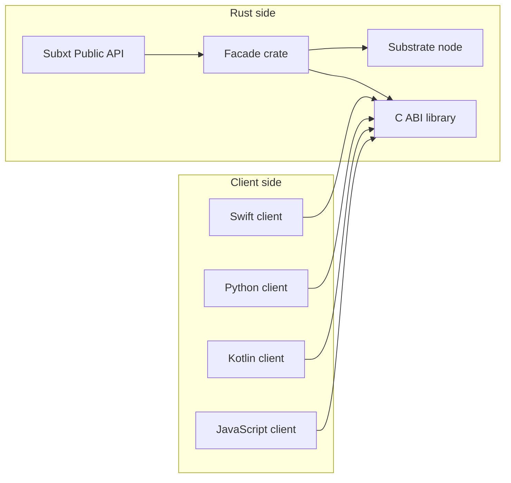

# ffi-example

This example shows how to expose a small piece of Subxt functionality, in our case, a single balance-transfer call, as a native C-ABI library, consumable from Python and Node.js.

## Overview

- We want to let non-Rust clients interact with any Substrate-based node (Polkadot in this example) via a tiny FFI layer.
- Instead of exposing Subxt’s full, Rust-centric API, we build a thin **facade crate** that:
  1. Calls Subxt under the hood  
  2. Exposes just the functions we need via `pub extern "C" fn …`  
- Client languages (Python, JavaScript, Swift, Kotlin, etc.) load the compiled `.so`/`.dylib`/`.dll` and call these C-ABI functions directly.



Our one example function is:

```rust
pub extern "C" fn do_transfer(dest_hex: *const c_char, amount: u64) -> i32
```

which does a single balance transfer and returns 0 on success, –1 on error.

## Prerequisites
- Rust toolchain (with cargo)
- Python 3
- Node.js (for the JS example. Version 19 worked on my M2 Mac, but version 22 did not, so YMMV).
- A running Substrate node (Polkadot) on ws://127.0.0.1:8000. One can use Chopsticks for a quick local Polkadot node:

  ```shell
  npx @acala-network/chopsticks \
    --config=https://raw.githubusercontent.com/AcalaNetwork/chopsticks/master/configs/polkadot.yml
  ```

  Or, if you have a `substrate-node` binary, just run `substrate-node --dev  --rpc-port 8000`.
- In our Python and Javascript files, we introduce a **dest** variable that represents the destination account for the transfer, we gave it a hard coded value (Bob's account public key) from the running Chopsticks node. Feel free to change it to any other account, or better yet, make it generic!

If you run into any issues running the Node version, I found that I needed to run `brew install python-setuptools` too.

## Building

### Build the Rust facade library

```shell
cargo build
```

This will produce a dynamic library in target/debug/ (or target/release/ if you pass --release):
- macOS: libsubxt_ffi.dylib
- Linux:  libsubxt_ffi.so
- Windows: subxt_ffi.dll

## Running

### Python

#### on macOS / Linux

```shell
python3 src/main.py
```

Expected output:

✓ transfer succeeded

### Node.js

#### Install npm dependencies
In the root of the project run:

```shell
npm install
```

then:

``` shell
node src/main.js
```

Expected output:

✓ transfer succeeded

# Development notes
- Hex handling: We strip an optional 0x prefix and decode into 32 bytes.
- FFI safety: We only pass pointers and primitive types (u64, i32) across the boundary.
- Error codes: We return 0 on success, -1 on any kind of failure (decode error, RPC error, etc.).
- You can extend this facade crate with any additional functions you need—just expose them as pub extern "C" and follow the same pattern.

# Limitations
Translating a complex Rust API like Subxt to a bare bones C ABI ready to be consumed by foreign languages has its limitations. Here's a few of them:

- Complex types (strings, structs) require to design C-safe representations.
- Only C primitive types (integers, pointers) are FFI-safe; anything else must be translated.
- Manual memory management glue code is needed if owned data is returned.
- Needs a manual translation to every foreign language we export to, every time the Rust library changes.

